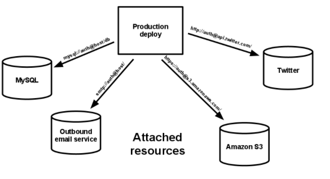

# BackingS ervices
## Partner Evan Fiordeliso
Microservices should be stateless and they should own their own data. 
They maintain this persistent state with use of backing services. For example, Microsoft Azure SQL Database, MySQL,
Amazon DynamDB and etc.This may change though. Kubernetes has recently added a way to maintain persistent state. 
And lastly third party services like Portworx and Roblin can help improve the reliability and resiliency for stateful services and bigger data applications.

With backing services, they act basically as an abstraction layer on top of these resources that are needed 
by the application like  datastores, messaging/queueing systems, SMTP services, metric-gathering services, 
or even API-accessible consumer services. This is beneficial because if you wish to switch out a local 
resource like a locally hosted MySQL database with a third party service like Amazon it would be as simple as a 
configuration change. This also allows for hot swapping servers if there may be some problem with the currently running server. 
All of these changes with the infrastructure would require zero code modifications as the abstraction allows the code 
to work with any service of a similar type with just a small configuration change to specify the service.

