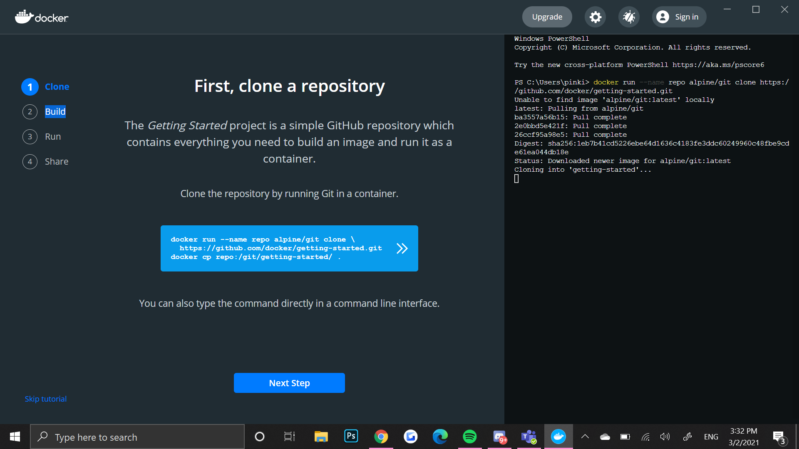
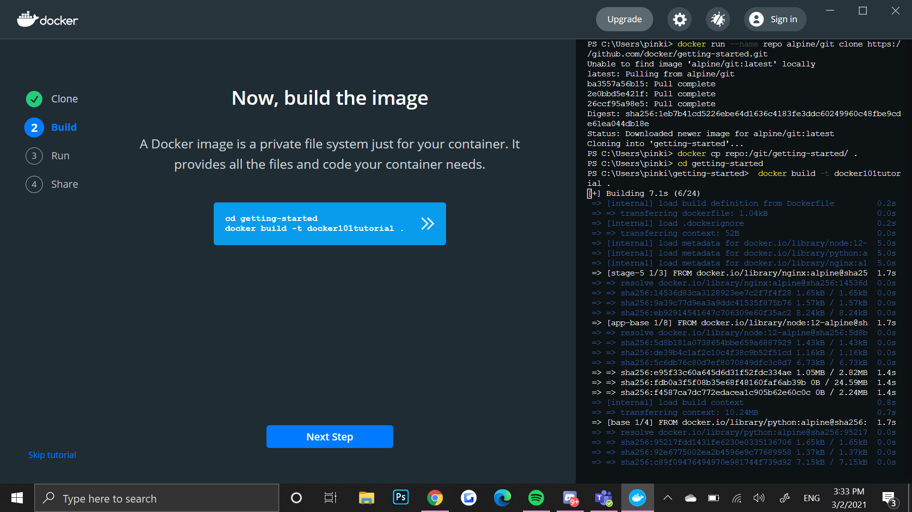
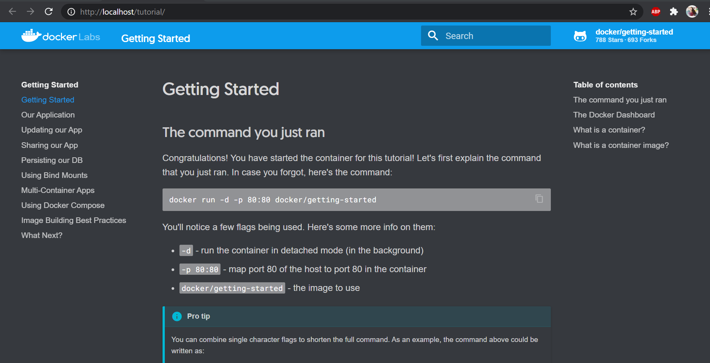
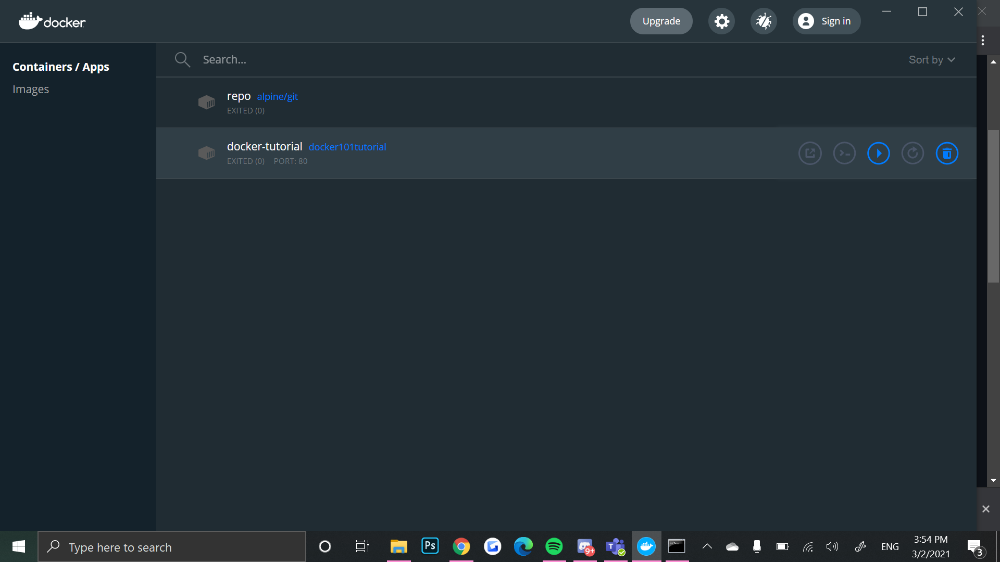

# Installing Docker
## Partner Evan Fiordeliso
### Installation Process
I installed docker from the website https://www.docker.com/ . 
Since I am on a windows computer I had to install WSL for docker to work. A problem that I ran into was I had to change my system information to allow
Virtualization. I had trouble accessing my bios but I finally figured out to just go into the windows start up setting and fix the problem to show bios when restarted.
When I was in the bios I enabled Virtualization. Then after that my docker worked. And I was presented with this page.

For the image I had to install I just did the tutorial that I was presented with at start up.

Building the image.

This is the page that I was presented when running the container.
- Docker UI.
Front-end to see what's going on in the docker system. It's not needed but it gives a good glimpse of what is happening in the machine. It needs a virutal machines to run because WSL. 

You can open it in browser and run it locally.

